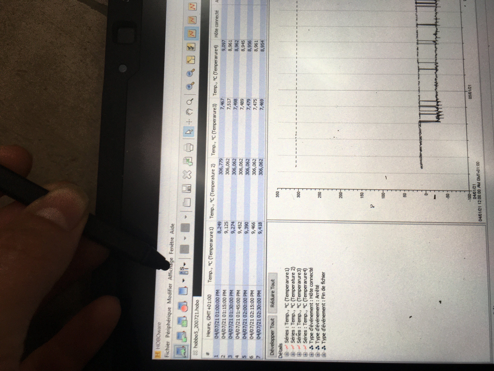

Experimental protocol for calibration of pressure sensors
=====================

# 1. Objectives 
The hydraulic head gradient between a point in the riverbed and the river is measured using pressure transducers. A membrane inside the pressure transducer bends in response to the pressures on either side of it. A membrane-enclosed electrical circuit converts the membrane's curvature into an electrical voltage U. The temperature T of the membrane affects the measured voltage U as well.

Therefore, it is necessary to establish the relationship between measured voltage, differential pressure, and temperature in order to convert the electrical voltage measured in the field into differential pressure. For every sensor, this relationship is different. The experimental procedure used to collect the measurements required for this calibration is described in this document's paragraphs 2 through 4, along with the steps taken to process the data and determine the calibration coefficients.
# 2.  Introduction to the experiments
For each sensor, it is necessary to perform at least:

* One voltage-differential pressure calibration (Part 3) ;
* Three calibrations of the constant water level, which can be done either outside or inside a climate chamber (Part 4).

The calibration molonari mini/data folder contains the calibration-related files. All of the calibration CSV files will be located in this folder. The Excel files used for the U-H calibrations are also located in this folder.

The experiment's data are then incorporated into the calibration_molonari_mini/data/1_raw_data/ folder, which in addition to the results from the experiments described in this protocol file, also includes the calibration coefficients, post-processing scripts, and figures. 

**It is important to follow the steps precisely to allow for efficient data processing afterwards.

**
# 3. **Voltage - Pressure Differential Calibration
On a calibration ramp, the voltage-differential pressure calibration is carried out. It involves defining the relationship between measured voltage and differential pressure for constant temperature.

 Figure 1 - Experimental set-up for the calibration of pressure sensors.

## Materials required

- The pressure sensor in its box, ready for calibration. Make sure to verify the pressure sensor's name, which is written on a tape attached to the device (not on the box housing the device);
- A Hobo dataloger;
- The calibration ramp : a wooden board;
- A computer and the USB cable to connect the Hobo to the computer;
- A funnel.

## Experimental protocol
### Hoboware setup
The date must be formatted in Month Day Year (see Figure 2)

 Figure 2 - Hoboware software date configuration.

The units must be in international system (See Figure 3)

 Figure 3 - Configuration of the Hoboware software units

### Preparation
  1. Install the calibration ramp vertically, connect the tubes of the wooden board to the outlets of the box (see Figure 1).
  2. Connect the 2 small tubes of the pressure sensor to the connectors on the box. To do this, fill each tube with water using the syringe, being careful not to leave any air bubbles in the tubes. Then push the tubes into the connectors.
  3. Add about 10 cm of water to each of the tubes on the wooden board. Use the funnel to help you. It is necessary to start with the same height of water in both tubes (right and left).
  4. Launch the Hoboware software. Connect the Hobo datalogger to the computer with the USB cable.
  5. Check the battery status of the Hobo by going to "Device Status". If the battery is too low (below 50%), change the battery of the Hobo or change the Hobo.
  6. From the Hoboware software, start the pressure and temperature recording (two recording channels out of 4 are used). The pressure sensor must be on channel 1 and named "voltage" and the temperature sensor must be on channel 2 and named "temperature." To do this, go to Peripheral > Launch. Select a time step of 30 seconds for the recording (see Figure 4).
 
 
 Figure 4 - Hobos configuration for calibration
 
  7. Record the names of the tubes on the sensor (right and left). 
  8. Create a calibration Excel file and name it [SensorName]\_calibUH, for example, p505\_calibUH. Save it in Dcalibration_molonari_mini/data/1_raw_data/. The first column of this file will contain the water levels in the left tube. The second column will contain the water levels in the right tube. The third column will contain the water level differential, the convention is "right minus left" (column B - column A). The fourth column will contain the voltages measured by the Hobo.

 

### Calibration

Before starting the calibration, make sure that the recording of temperatures and voltages has been started (Step 6 of preparation). While the recording is running, display the "Device Status" window.

1. Enter the water level in the left column and the water level in the right column in the Excel file. The third column, defined by column A, must contain the load difference.
2. Wait for the voltage measured by the pressure sensor to stabilize (this voltage is displayed in the Device Status window). Then transfer it to the fourth column.
3. Add water to the left-hand column. 
4. Repeat from point 1.
5. As long as the voltage sensor has not reached saturation, repeat these steps every 5 mm between 0 and 5 cm, every 1 cm between 5 and 15 cm, and finally every 5 cm between 15 cm. 6. Follow these same instructions on the opposite side to calibrate the device from tablecloth to river and from river to tablecloth. Change "left" to "right" in point b after the sensor has reached saturation, then repeat the change until you reach the second plateau of saturation. Create an Excel graph that plots the measured voltage against the difference in water height after a few points have been made (column D against column C). As you proceed, use this graph to make sure the points are plotted in a straight line.

7. At the end of the calibration
  a. Verify that the recording has been stopped before removing it from the hobo dataloger (Device > sate). Save the Hobo recordings as a.hobo file in the same calibration LOMOS mini/data/1 raw data/ [sensorName] folder as the Excel calibration file. The file should be named [sensorname] calibUH.hobo. On the pressure sensor, a tape with the sensor's name is visible (not on the box containing it).
  
  b. Export the hobo's data measurements to a csv file. To do this:
  
  b1. Open the Hobo file with Hoboware with File > Open data file
 
 b2. Export by doing File > Export Table Data, click on Export, and select "csv" as file type. Keep the same name as the hobo file.
 
 c. Update the  Excel file by adding the date of the experiment and the person's name.
 d.The corresponding sensor folder should now contain the Excel calibration file and the Hobo csv file.
# 4. Voltage-temperature calibration

 At constant differential pressure, the relationship between measured voltage and temperature variation is established using voltage-temperature calibrations. A climatic chamber calibration method and an outdoor calibration method have both been developed. The two paragraphs that follow provide descriptions of them. The method used in the climate chamber is preferred because it enables temperature control of the surrounding air.

***The metadata related to each U-T calibration must be reported in an Excel dashboard.** A reference version named pxxx\_YYYY-mm-dd\_UTxxxxxxxx\_Dashboard is available in the folder 1\_raw\_data/modele. Replace the first field of xxx by the corresponding sensor number, the field YYYY-mm-dd by the start date of the experiment, and the last field xxxxx by "room" or "outside".
 ## 4.1. **Calibration in the climatic chamber
In comparison to calibration outside, the climatic chamber offers the advantage of being able to control the ambient temperature; however, while operating, the climatic chamber vibrates and muffles the measured voltage signal.

**Important note:** Prepare the device the day before, measure the water heights, and start the environmental chamber only the next day to prevent the first experiment from being invalidated because the pipes are deformed.

### Required equipment

* The calibrated pressure sensor in its box. 
* A Hobo datalogrt;
* The field computer with: 
  * A syringe
  * A voltmeter
  * Batteries 
* Two pieces of pipe with a diameter of 16 mm and a length of approximately 20 cm;
 ### Experimental protocol

 #### Preparation**

1. Copy the template file (data / 1\_raw\_data / modele / pxxx\_YYYY-mm-dd\_UTxxxxxxxx\_chart.xlsx) into the corresponding sensor folder (data / 1\_raw\_data / pxxx\_YYYY-mm-dd\_calibUH / pxxx\_YYYY-mm-dd\_UTChambre\_rampe\_chart).
2. Change the name file (eg. p509\_2016-07-08\_UTChambre\_rampe\_tableauDeBord).
3. Open the first tab of the Excel file. Three experiments must be conducted. In the column labeled "target differential," the pressure differential corresponding to each experiment is indicated.
4. Prepare the sensor for the 1st experiment (see the experimental protocol described in "experimental protocol" in paragraph 4.2). **Start the hobo with a time step of 1min**.
5. Fill in the water levels on both sides of the sensor, keeping the desired differential.
6. Place the sensor in the climate chamber.
7. Record the water level on the riverbank and in the hyporheic zone and transfer the data to an Excel spreadsheet. Verify that the estimated differential is in close proximity to the desired differential.
8. Complete the date and name fields.
9.Close the climate chamber and run the program to decrease the temperature from 25 to 5 °C over  six hours, followed by an increase from 5 to 25 °C over six hours.
10. Collect the data

  a.  Before moving the sensors, measure the water levels in the tubes when the environmental chamber is opened and add them to the Excel table. If the heights have changed substantially, repeat the experiment. otherwise, keep reading:
 
  b.Verify that the recording has concluded prior to removing the file . Save the Hobo recordings in the same folder as the Excel calibration file as a.hobo file on the field computer: *data / 1\ raw\ data / [sensorName]*. 
  
  c. The file should be named [sensorname] calibUT [experiment number].hobo. The experiment number is indicated on the Excel sheet.

d.Export the data measured by the hobo to a csv file. To do this:
  
 e. Open the hobo file using File > Open Data File in Hoboware software
  
  f. Export by selecting File > Export Table Data, clicking Export, and selecting CSV as the file format. Maintain the same filename as the hobo file.
  
  i.  Update the Excel file *Update the Excel spreadsheet *etalCapteursPress tableauDeBord* by including the experiment date.
  
  
11.Repeat these procedures for the two additional pressure differentials.

When all 3 experiments have been completed, proceed to the steps in REF 4.3.
 ## 4.2. **Outdoor calibration
To benefit from the differences in temperature between day and night, calibration is carried out outside. Each calibration has a desired load differential value (deviating from this target value by a few mm is not a problem, see 1.e). The Excel document contains the target values.*etalCapteursPress\_tableauDeBord*.

### Time needed

2 to 2:30 hours. It is more efficient to perform multiple calibrations simultaneously; the preparation of the equipment takes the most time.

### Experimental protocol

1. Start the recording. 
2. Complete the Excel spreadsheet *_tableauDeBord* 
3. Using the voltmeter, examine the pressure sensor's batteries. They must be within 1V of 7.5V.
4. Connect the sensor's tubes together. Fill each small tube with water using the syringe, ensuring that there are no air bubbles in the tubes. 
5. Connect the 2 tubes to the glands on the outside of the box. 
6. Attach the clamps to the top of each tube, and connect the two pipes with a string, so that the device looks like the one in REF \_Ref430347103 \h Figure 2. 
7. Add approximately 10 cm of water to each tube. 
8. Examine the battery capacity of the Hobo datalogger. If the battery is less than 80% charged, the battery or Hobo should be replaced.
9. Link Hobo to the pressure sensor. Channel 1 is pressure, channel 2 is temperature. 
10. From the Hoboware software, launch the pressure and temperature recording. To do this, go to Peripherals > Launch. Channel 1 is the pressure (Stereo cable 0-2.5V), channel 2 is the temperature . Uncheck channels 3 and 4. Select a *time step of **15 minutes*** for recording.

11. Disconnect the Hobo datalogger from the computer and place the pressure sensor + Hobo device outsidel, according to Figure 2. 
12. Fill in the water level in each of the tubes until you reach a difference approximately equal to the target value indicated in the Excel document *etalCapteursPress\_tableDeBord*. 

13. Complete the Excel document *etalCapteursPress\_tableauDeBord*

Leave the recording for <b>3-4 days</b>.

14. Recovery of registration
* Turn on the field computer and open the Hoboware application.
 * Connect the Hobo to the computer.
* Pull recording from hobo (Device > Playback), confirming stop recording. Save Hobo recordings on the field computer in a .hobo file, in the same folder as the calibration Excel file: *data/1\_raw\_data/[sensorname]*. Name the file *[sensor name]\_caliBUT\_[experiment number].hobo*. .

  * Export the data measured by the hobo to a csv file. To do this:
    * Open the hobo file with Hoboware with File > Open a data file
    * Export by doing File > Export Table Data, click on Export, and select "csv" as file type. Keep the same name as the hobo file.
    * Add the hobo and csv files to the sensor folder.

Figure 2 - Experimental setup for voltage-temperature calibration at constant load differential.

# 5.  Following the voltage-temperature calibration
1. Fill in the sensor monitoring file Suivi_capteurs\_pression.xlsx,
2.  In the tab calibrations, fill the type of calibration carried out for the sensor;
3.  In the tab corresponding to the calibrated sensor, report the details of the calibrations and possibly the anomalies found during the recordings.
4.  In the folder /data/1\_raw\_data/pxxx/pxxx\_YYYY-etc, make sure that there are :
 * the .hobo files of the recordings ;
  * the Excel file for the dashboard with the 1st tab completely filled in.

# 7. **Data formatting
For both types of calibration (voltage-differential charge and voltage-temperature), the recordings are contained in hobo files. They must therefore be converted into csv files that can be read by the R scripts.

1. In Hoboware, do File > Export Table Data ... Save the csv in the same folder as the corresponding hobo file, and keep the same file name (only the extension changes from .hobo to .csv).

2. For voltage-load calibrations:

 * Transform the Excel file into a csv file readable by R scripts. As described in paragraph 3, the 3rd column must contain the load differential, and the 4th column must contain the corresponding measured voltage. 
 * Transform the .hobo record file into a .csv file. The name of the recording file must end with "\_recording.csv".

Figure 3 - Files corresponding to the voltage-charge calibration for the p506 sensor. The script 1\_rawToFormatted.R reads the 2 .csv files.

3. For the voltage-temperature calibrations, a few additional steps are required.

   * In the csv file, remove the parts of the record that do not correspond to the experiment (e.g., in the climate chamber, remove what was recorded outside the operation of the chamber).
   * Report the load differentials in a new tab of the Excel document, opposite the name of the corresponding record file (see Figure 4). If the record must be ignored for some reason, indicate "invalid" in place of the load differential. Then export this tab as a csv file, with the name "dashboard". It is important to do this step correctly, because it is this file that is then read by the scripts.
   * Once these different steps have been carried out, launch the R script 1\_rawToFormatted.R which reads the different data files and puts everything in a homogenized form, in the folder 2\_formatted\_data.

Figure 4 - Transfer of hydraulic head differentials for each U-T record on the file's second tab.p505\_2016-08\_UTChambre\_rampe\_tableauDeBord.xlsx. Each row corresponds to a record: column A contains the corresponding file name, column B contains the applied load differential. This tab must then be saved in csv format, it will be read by the script 1\_rawToFormatted.R.

Figure 5 - Example of the files corresponding to the climate chamber experiment at the end of the steps in paragraph 5.1. The files read by the script R 1\_rawToFormatted.R is the set of csv files.
# 7. **Manual pre-processing**
At the end of the script 1\_rawToFormatted.R all the data are saved in the folder 2\_data\_formatted, in a homogenized form. It is now possible to make some modifications to the data, if necessary. Several types of modifications can be considered:

The problematic portion of the record can be manually removed, or the record can be truncated if there is a problem. Plots created with 0 plot raw.R is intended to assist with this step. 
 In this case, record the manual alterations in a text file with the name modifications.txt that was saved in the same directory as the formatted data. 
 Save the updated information in a file bearing the same name but prefixed with "_modif."
Filter the climate chamber signal that was captured. For each temperature slope, a linear regression of the recorded voltage is computed. The linear regression function in the script 2 filterClimaticChamber can be used. The file names end with "flt.csv" after this step. 5. Correct the offset offsets between the U-T curves and the U-H calibration curve.

# 8. Calculation of Calibration Curves R scripts then process the data gathered during the calibrations described above to determine the relationship between the measured voltage, the applied differential load, and the temperature. The [README.md](README.md) provides information on the various processing steps. This paragraph goes into detail about the recordings' post-processing. All of the files pertaining to the calibration of the sensors can be found in the calibration folder. The raw data are saved in the calibration/data/1 raw data folder, as was previously mentioned. The scripts are in the calibration/scripts R directory.
