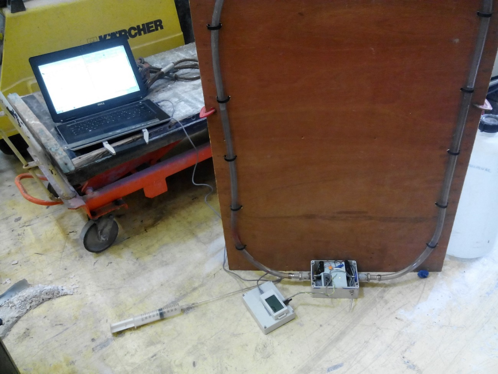
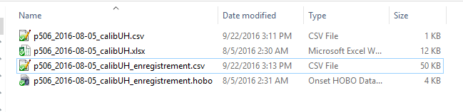
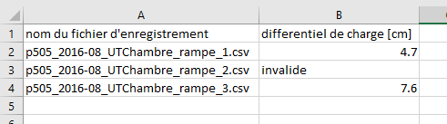
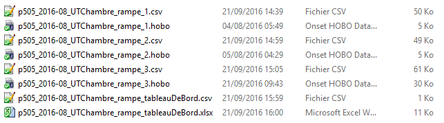

Protocole expérimental pour calibration des capteurs de pression
=====================

# 1.  **Objectifs**
Les capteurs de pression sont utilisés pour mesurer le gradient de charge entre la rivière et un point sous le lit de la rivière. Le capteur de tension contient une membrane qui se courbe selon les pressions qui s’exercent de part et d’autre de celle-ci. Un circuit électrique construit autour de la membrane traduit la courbure de la membrane en tension électrique U. La tension électrique mesurée U est également fonction de la température T de la membrane.

Ainsi, pour traduire la tension électrique mesurée sur le terrain en pression différentielle, il est nécessaire d’établir la relation entre tension mesurée, pression différentielle et température. Cette relation est différente pour chaque capteur. Ce document indique le protocole expérimental pour obtenir les mesures nécessaires à cette calibration (paragraphes 2 à 4), ainsi que les étapes pour traiter les données pour obtenir les coefficients de calibration.
# 2.  **Introduction aux expériences**
Pour chaque capteur, il est nécessaire de faire au moins:

* Un étalonnage tension – pression différentielle (paragraphe  REF \_Ref462238442 \n \h 3);
* Trois étalonnages en charge constante, qui peuvent s’effectuer en extérieur ou en chambre climatique (paragraphe  REF \_Ref462238479 \n \h 4).

Le nom des capteurs de pression (p505 etc) est indiqué sur chaque capteur sur un scotch.

Les fichiers liés à la calibration sont enregistrés dans le dossier calibration_molonari_mini/data. Le fichier Excel *etalCapteursPress\_tableauDeBord* permet de suivre les étalonnages qui ont été faits et ceux qui restent à faire. Les fichiers hobo et csv contiennent les enregistrements des expériences et sont enregistrés dans des dossiers correspondant aux différents capteurs. Ces dossiers contiennent également les fichiers Excel des calibrations U-H.

Les données des expériences sont ensuite intégrées dans le dossier capteurs\_pression/calibration, qui en plus des données des expériences détaillées dans ce fichier de protocole contient les scripts de post-traitement, des figures et les coefficients de calibration, but final de ces expériences. L’ensemble des fichiers est stocké dans le dossier calibration_molonari_mini/data

**Il est important de suivre les étapes précisément pour permettre un traitement efficace des données par la suite.**
#  3. **Étalonnage tension – pression différentielle**
L’étalonnage tension – pression différentielle se fait sur une rampe d'étalonnage. Elle consiste à établir la relation entre pression différentielle et tension mesurée, pour une température constante.

 Figure 1 - Dispositif expérimental pour la calibration des capteurs de pression.

## Matériel nécessaire

- Le capteur de pression à calibrer, dans sa boîte. Bien vérifier le nom du capteur de pression, qui est indiqué sur un scotch sur le capteur de pression (et pas sur la boîte contenant le capteur de pression);
- Un Hobo;
- Le panneau en bois;
- L’ordinateur de terrain et le câble USB permettant de connecter le Hobo à l’ordinateur (normalement dans la pochette de l’ordinateur de terrain);
- Un entonnoir.

## Protocole expérimental

### Préparation
  1. Installer la planche en bois verticalement, connecter les tubes de la planche en bois aux sorties de la boîte (voir Figure 1).
  2. Connecter les 2 petits tubes du capteur de pression aux connecteurs présents sur la boîte. Pour cela, remplir d’eau chaque petit tube à l’aide de la seringue, en faisant attention à ne pas laisser de bulles d’air dans les tubes. Puis enfoncer les petits tubes dans les connecteurs.
  3. Ajouter une dizaine de centimètres d’eau dans chacun des tubes de la planche en bois. S’aider de l’entonnoir. Il est néssaire de débuter avec la même hauteur d'eau dans les deux tubes (droite et gauche)
  4. Allumer l’ordinateur de terrain et lancer le logiciel Hoboware de l’ordinateur de terrain. Connecter le Hobo a l’ordinateur à l’aide du câble USB.
  5. Vérifier l’état de la pile du Hobo en allant dans “État du Périphérique”. Si la pile est trop faible (en dessous de 50%), changer la pile du Hobo ou changer de Hobo.
  6. A partir du logiciel Hoboware, lancer l’enregistrement de la pression et de la température (deux canaux d’enregistrement sur 4 sont utilisés). Le capteur de pression doit être sur le canal 1 et nommé "tension" et le capteur de température doit être sur le canal 2 et il doit se nommer "température". Pour cela, aller dans Périphérique > Lancer. Sélectionner un pas de temps de 30 secondes pour l’enregistrement.
  7. Noter sur le capteur le nom des tubes sur le capteur (droite et gauche). 
  8. Créer un fichier Excel de calibration, le nommer [nomDuCapteur]\_calibUH, par exemple p505\_calibUH. L’enregistrer dans Dcalibration_molonari_mini/data/1_raw_data/. La première colonne de ce fichier contiendra les hauteurs d’eau dans le tube gauche. La deuxième colonne contiendra les hauteurs d’eau dans le tube de droite. La troisième colonne contiendra le différentiel de hauteur d’eau, la convention est “droite moins gauche” (colonne B – colonne A). La quatrième colonne contiendra les tensions mesurées par le Hobo.
  
### Calibration

Avant de commencer la calibration, s’assurer que l’enregistrement des températures et des tensions a bien été lance (étape 6 de préparation). Tout en laissant l’enregistrement, afficher la fenêtre “état du Périphérique”.

1. Reporter dans le fichier Excel la hauteur d’eau dans la colonne de gauche, la hauteur d’eau dans la colonne de droite. La troisième colonne, définie par colonne colonne A, doit contenir la différence de charge.
2. Attendre que la tension mesurée par le capteur de pression se stabilise (cette tension s’affiche dans la fenêtre État du Périphérique). Puis la reporter dans la quatrième colonne.
3. Ajouter de l'eau dans la colonne de gauche.
4. Reprendre au point 1.
5. faire ces étapes tous les 5 mm entre 0 et 5 cm, puis tous les 1 cm entre 5 et 15 cm puis tous les 5 cm entre le 15 cm et jusqu'à la saturation du capteur de tension n’est pas arrivé à saturation 
6. Refaire ces étapes de l'autre coté pour avoir l'étalonnage dans le sens nappe-> rivière et rivière ->nappe. Une fois que le capteur est arrivé à saturation, remplacer “gauche” par “droite” dans le point b, et reprendre la manipulation jusqu’à arriver au deuxième plateau de saturation.

Une fois que quelques points ont été effectués, créer un graphe sous Excel qui reporte la tension mesurée en fonction de la différence de hauteur d’eau (colonne D en fonction de colonne C). A l’aide de ce graphe, vérifier au fur et à mesure de la manip que les points reportés s’alignent selon une droite.

7. A la fin de la calibration
  a. Extraire l’enregistrement du hobo (Périphérique > Lecture), confirmer l’arrêt de l’enregistrement. Enregistrer les enregistrements du Hobo sur l’ordinateur de terrain dans un fichier .hobo, dans le même dossier que le fichier Excel de calibration: calibration_molonari_mini/data/1_raw_data/ [nomDuCapteur]. Nommer le fichier [nomDuCapteur]\_calibUH.hobo. Le nom du capteur est indiqué sur un scotch sur le capteur de pression (et non sur la boîte le contenant).
  b. Exporter les données mesurées par le hobo dans un fichier csv. Pour cela:
  c. Ouvrir le fichier hobo avec Hoboware avec Fichier > Ouvrir un fichier de données
  d. Exporter en faisant Fichier > Données de Tableau d’exportation, cliquer sur Exporter, et sélectionner “csv” comme type de fichier. Garder le même nom que le fichier hobo.
  e. Mettre à jour le document Excel etalCapteursPress\_tableauDeBord en ajoutant la date de l’expérience et le nom de la personne.
  f. Mettre à jour le svn data-hz. (ou envoyer les fichiers a karina.cucchi@gmail.com)
  g. Remplacer le fichier Excel etalCapteursPress\_tableauDeBord par sa nouvelle version.
  h.Ajouter les fichiers hobo, csv et Excel de calibration dans le dossier correspondant au capteur.
#  4. Étalonnage tension – température
Les étalonnages tension-température servent à établir la relation entre tension mesurée et variation de température, à pression différentielle constante.

Deux méthodes d’étalonnage ont été développées, une méthode en chambre climatique et une méthode en extérieur. Elles sont décrites dans les 2 paragraphes qui suivent. La méthode en chambre climatique est préférable car elle permet de contrôler la température ambiante.

***Important :*** **Les métadonnées relatives à chaque étalonnage U-T doivent être reportées dans un tableau de bord Excel.** Une version de référence nommée pxxx\_YYYY-mm-dd\_UTxxxxxxxx\_tableauDeBord est disponible dans le dossier 1\_raw\_data/modele. Remplacer le premier champ de xxx par le numéro correspondant de capteur, le champ YYYY-mm-dd par la date de début d’expérience, le dernier champ xxxxx par "chambre" ou "exterieur".
 ## 1. **Étalonnage en chambre climatique**
La remise en fonctionnement de la chambre climatique de la halle a permis de faire évoluer les protocoles de calibration. La chambre climatique permet de contrôler la température ambiante et présente donc un avantage certain par rapport à la calibration en extérieur ; cependant la chambre climatique vibre lors de son fonctionnement et bruite le signal de tension mesuré.

**Note importante :** Pour éviter que la 1e expérience ne soit pas valide parce que les tuyaux de déforment, préparer le dispositif la veille, mesurer les hauteurs d’eau et lancer la chambre climatique le lendemain uniquement.

 ### **Matériel nécessaire**

* Le capteur de pression à calibrer, dans sa boîte. Bien vérifier le nom du capteur de pression, qui est indiqué sur un scotch sur le capteur de pression (et pas sur la boîte contenant le capteur de pression);
* Un Hobo ;
* L’ordinateur de terrain avec: 
  *  le câble USB permettant de connecter le Hobo à l’ordinateur;
  *  un tournevis pour ouvrir les boîtes des capteurs de pression.
*  Une boîte à outils avec :
  *  Un cutter
  *  Une seringue et son embout
  *  Un voltmètre
  *  Des piles pour le Hobo
*  Deux bouts de tuyaux de diamètre 16 mm d’une vingtaine de centimètres chacun ;
* Une ficelle, deux colliers, 2 bouchons d’oreille (voir  REF \_Ref430347103 \h  \\* MERGEFORMAT Figure 2) ;
- Une grande caisse bleue pour couvrir le dispositif à l’extérieur.
 ### **Protocole expérimental**

 #### Préparation**

1. Copier le fichier de modèle (data / 1\_raw\_data / modele / pxxx\_YYYY-mm-dd\_UTxxxxxxxx\_tableauDeBord.xlsx) dans le dossier du capteur correspondant (data / 1\_raw\_data / pxxx\_YYYY-mm-dd\_calibUH / pxxx\_YYYY-mm-dd\_UTChambre\_rampe\_tableauDeBord).
2. Dans le nom du fichier, modifier les xxx (eg. p509\_2016-07-08\_UTChambre\_rampe\_tableauDeBord).
3. Ouvrir le fichier Excel, le 1er onglet. Il y a 3 expériences à compléter. Chaque expérience correspond à un différentiel de pression, indiqué dans la colonne « différentiel cible ».
4. Préparer le capteur pour la 1e expérience (cf. protocole expérimental décrit dans « protocole expérimental » dans le paragraphe 4.2). **Lancer le hobo avec un pas de temps de 1min**.
5. Remplir les hauteurs d’eau de part et d’autre du capteur, en ayant en tête le différentiel cible.
6. Placer le capteur dans la chambre climatique.
7. Relever les hauteurs d’eau du côté rivière et du côté zone hyporhéique, les reporter sur le fichier Excel. Vérifier que le différentiel estimé est proche du différentiel cible.
8. Remplir également les colonnes dates et personnes.
9. Fermer la chambre climatique et lancer le programme contenant une rampe allant de 25 à 5°C en 6h et une deuxième rampe faisant le chemin inverse.
10. Récupération des données
  a.  A l’ouverture de la chambre climatique, et **avant de déplacer les capteurs**, mesurer les hauteurs d’eau dans les tubes et les reporter sur le tableau Excel. **Si les hauteurs ont changé de manière trop importante, il faut refaire l’expérience**… Sinon, continuer :
  b. Lancer le logiciel Hoboware.
  c. Brancher le Hobo a l’ordinateur. 
  d. Extraire l’enregistrement du hobo (Périphérique > Lecture), confirmer l’arrêt de l’enregistrement. Enregistrer les enregistrements du Hobo sur l’ordinateur de terrain dans un fichier .hobo, dans le même dossier que le fichier Excel de calibration: *data / 1\_raw\_data /[nomDuCapteur]*. 
  e. Nommer le fichier *[nomDuCapteur]\_calibUT\_[numéro de l’expérience].hobo*. Attention, le nom du capteur est indiqué sur un scotch sur le capteur de pression. Le numéro de l’expérience est indiqué sur la feuille Excel *etalCapteursPress\_tableauDeBord*.
  f. Exporter les données mesurées par le hobo dans un fichier csv. Pour cela :
  g. Ouvrir le fichier hobo avec Hoboware avec Fichier > Ouvrir un fichier de données
  h. Exporter en faisant Fichier > Données de Tableau d’exportation, cliquer sur Exporter, et sélectionner “csv” comme type de fichier. Garder le même nom que le fichier hobo.
  i.  Mettre à jour le document Excel *etalCapteursPress\_tableauDeBord* en ajoutant la date de l’expérience de fin d’expérience et le nom de la personne.
11. Refaire ces étapes pour les deux autres différentiels de pression.

Lorsque les 3 expériences ont été réalisées, passer aux étapes du paragraphe  REF \_Ref469048893 \r \h 4.3
 ## 2. **Étalonnage en extérieur**
L’étalonnage à vide se fait en extérieur, pour profiter des variations de température jour-nuit. Chaque étalonnage à une valeur cible de différentielle de charge (dévier de cette valeur cible de quelques mm n’est pas un problème, voir 1.e). Voir les valeurs cibles dans le document Excel *etalCapteursPress\_tableauDeBord*.

### Temps nécessaire

Prévoir 2h-2h30. Il est plus efficace de lancer plusieurs calibrations en même temps, ce qui prend du temps est surtout la préparation du matériel.

### Matériel nécessaire

1. Le capteur de pression à calibrer, dans sa boîte. Bien vérifier le nom du capteur de pression, qui est indiqué sur un scotch sur le capteur de pression (et non sur la boîte contenant le capteur de pression);
2. Un Hobo ;
3. L’ordinateur de terrain avec
  * le câble USB permettant de connecter le Hobo à l’ordinateur;
  * un tournevis pour ouvrir les boîtes des capteurs de pression.
4. Une boîte à outils avec :
  * Un cutter
  * Une seringue et son embout
  * Un voltmètre
  * Des piles pour le Hobo
5. Deux bouts de tuyaux d’une vingtaine de centimètres chacun ;
6. - Une ficelle, deux colliers, 2 bouchons d’oreille (voir  REF \_Ref430347103 \h  \\* MERGEFORMAT Figure 2) ;
7. Une grande caisse bleue pour couvrir le dispositif à l’extérieur.

### **Protocole expérimental**

1. Lancement de l’enregistrement
2. Remplir le document Excel *etalCapteursPress\_tableauDeBord* : dans la case correspondant au capteur traité, reporter la date du début de l’expérience et le(s) nom(s) des personnes qui font la manip.
3. Vérifier les piles du capteur de pression à l’aide du voltmètre. Elles doivent être à 7.5V (±1V).
4. Connecter les branches du capteur aux presse-étoupes. Pour cela, remplir d’eau chaque petite branche à l’aide de la seringue, en faisant attention à ne pas laisser de bulles d’air dans les tubes. Puis enfoncer les petits tubes dans les presse-étoupes.
5. Connecter les 2 bouts de tuyau aux presse-étoupes à l’extérieur de la boîte.
6. Accrocher les colliers en haut de chaque tuyau, relier les deux tuyaux à l’aide d’une ficelle, pour que le dispositif ressemble à celui de la  REF \_Ref430347103 \h Figure 2. Veiller à ce que le dispositif passe sous la caisse bleue qui recouvrira les dispositifs dehors.
7. Ajouter une dizaine de centimètres d’eau dans chaque tube.
8. Vérifier l’état de la pile du Hobo. S’il n’y a pas de pile dans le Hobo, en mettre. Changer de pile ou de Hobo si la pile est charge à moins de 80%.
9. Brancher le Hobo au capteur de pression. Le canal 1 est la pression, le canal 2 est la température. Deux canaux d’enregistrement sur 4 sont utilisés.
10. A partir du logiciel Hoboware, lancer l’enregistrement de la pression et de la température. Pour cela, aller dans Périphérique > Lancer. Le canal 1 est la pression (Câble Stéréo 0-2.5V), le canal 2 est la température (). Décocher les canaux 3 et 4. Sélectionner un *pas de temps de **15 minutes*** pour l’enregistrement.
11. Débrancher le Hobo de l’ordinateur, placer le dispositif capteur de pression + Hobo à l’extérieur de la halle, selon la  REF \_Ref430347103 \h  \\* MERGEFORMAT Figure 2. 
12. Compléter les hauteurs d’eau dans chacun des tubes jusqu’à arriver à une différence environ égale à la valeur cible indiquée dans le document Excel *etalCapteursPress\_tableauDeBord*. Boucher les tubes avec les bouchons d’oreille pour éviter que des détritus s’introduisent dans les tubes.
13. Compléter le document Excel *etalCapteursPress\_tableauDeBord* : dans la case correspondant au capteur traité, reporter les hauteurs d’eau mesurées, et vérifier que le différentiel de hauteur calculé est proche de la valeur cible.

Laisser l’enregistrement pendant <b>3-4 jours</b>.

14. Récupération de l’enregistrement
  * Allumer l’ordinateur de terrain et lancer le logiciel Hoboware.
  * Brancher le Hobo a l’ordinateur. 
  * Extraire l’enregistrement du hobo (Périphérique > Lecture), confirmer l’arrêt de l’enregistrement. Enregistrer les enregistrements du Hobo sur l’ordinateur de terrain dans un fichier .hobo, dans le même dossier que le fichier Excel de calibration: *data / 1\_raw\_data /[nomDuCapteur]*. Nommer le fichier *[nomDuCapteur]\_calibUT\_[numéro de l’expérience].hobo*. Attention, le nom du capteur est indiqué sur un scotch sur le capteur de pression. Le numéro de l’expérience est indiqué sur la feuille Excel *etalCapteursPress\_tableauDeBord*.
  * Exporter les données mesurées par le hobo dans un fichier csv. Pour cela:
    * Ouvrir le fichier hobo avec Hoboware avec Fichier > Ouvrir un fichier de données
    * Exporter en faisant Fichier > Données de Tableau d’exportation, cliquer sur Exporter, et sélectionner “csv” comme type de fichier. Garder le même nom que le fichier hobo.
  * Mettre à jour le document Excel *etalCapteursPress\_tableauDeBord* en ajoutant la date de l’expérience et le nom de la personne.
  * Mettre à jour le svn data-hz. (ou envoyer les fichiers a karina.cucchi@gmail.com)
    * Remplacer le fichier Excel *etalCapteursPress\_tableauDeBord* par sa nouvelle version.
    * Ajouter les fichiers hobo et csv dans le dossier correspondant au capteur.

Figure  SEQ Figure \\* ARABIC 2 - Dispositif expérimental pour la calibration tension-température à différentiel de charge constant
# 5.  Suite à l’étalonnage tension-température
1. Remplir le fichier de suivi des capteurs Suivi\_capteurs\_pression.xlsx, situe dans le svn data-hz/Avenelles/raw\_data/DESC\_data/DATA\_SENSOR/capteurs\_pression :
2.  Dans l’onglet calibrations, remplir le type de calibration effectue pour le capteur ;
3.  Dans l’onglet correspondant au capteur calibre, reporter les détails des calibrations et éventuellement les anomalies repérées lors des enregistrements.
4.  Dans le dossier /data/1\_raw\_data/pxxx/pxxx\_YYYY-etc, s’assurer que sont présents :
 * les fichiers .hobo des enregistrements ;
  * le fichier Excel de tableau de bord avec le 1e onglet rempli complètement.
#  6. **Traitement des données enregistrées**
Les données enregistrées lors des calibrations détaillées ci-dessus sont ensuite traitées par des scripts R pour arriver établir la relation entre tension mesurée, charge différentielle appliquée et température.

Le post-traitement des enregistrements est détaillé dans ce paragraphe.

Le dossier calibration contient toutes les fichiers relatifs à la calibration des capteurs. Comme expliqué dans les paragraphes précédents, **les données brutes sont enregistrées dans le dossier calibration/data/1\_raw\_data**. Les scripts se trouvent dans calibration/scripts\_R.
# 7. **Mise en forme des données**
Pour les deux types d’étalonnage (tension-charge différentielle et tension-température), les enregistrements sont contenus dans des fichiers hobo. Il faut donc les convertir en fichiers csv lisibles par les scripts R.

1. Pour chacun des fichiers .hobo, dans Hoboware, faire File > Export Table Data … Enregistrer le csv dans le même dossier que le fichier hobo correspondant, et garder le même nom de fichier (seule l’extension change de .hobo à .csv).

2. Pour les étalonnages tension-charge :

 * Transformer l’Excel en fichier csv lisible par les scripts R. Conformément a la description du paragraphe  REF \_Ref462238442 \r \h  \\* MERGEFORMAT 3, la 3e colonne doit contenir le différentiel de charge, et la 4e colonne doit contenir la tension mesurée correspondante. 
 * Transformer le fichier .hobo d’enregistrement en fichier .csv. Le nom du fichier d’enregistrement doit se terminer par "\_enregistrement.csv".

Figure  3 – Fichiers correspondant à la calibration tension-charge pour le capteur p506. Le script 1\_rawToFormatted.R lit les 2 fichiers .csv.

3. Pour les étalonnages tension-température, quelques étapes supplémentaires sont nécessaires.

   *  Dans le fichier csv, retirer les parties de l’enregistrement ne correspondant pas à l’expérience (par exemple, dans la chambre climatique, retirer ce qui a été enregistré en dehors du fonctionnement de la chambre).
   * Reporter les différentiels de charge dans un nouvel onglet du document Excel, en face du nom du fichier d’enregistrement correspondant (voir  REF \_Ref462300596 \h Figure 4). Si l’enregistrement doit être ignoré pour une raison ou une autre, indiquer « invalide » à la place du différentiel de charge. Exporter ensuite cet onglet en csv, dont le nom contient « tableauDeBord ». Il est important de faire cette étape correctement, car c’est ce fichier qui est ensuite lu par les scripts.
   * Une fois que ces différentes étapes ont été réalisées, lancer le script R 1\_rawToFormatted.R qui lit les différents fichiers de données et met tout sous une forme homogénéisée, dans le dossier 2\_formatted\_data.

Figure  SEQ Figure \\* ARABIC 4 - Report des différentiels de charge pour chacun des enregistrements U-T dans le 2e onglet du fichier p505\_2016-08\_UTChambre\_rampe\_tableauDeBord.xlsx. Chaque ligne correspond à un enregistrement : la colonne A contient le nom du fichier correspondant, la colonne B contient le différentiel de charge appliqué. Cet onglet doit ensuite être enregistré en format csv, il sera lu par le script 1\_rawToFormatted.R.

Figure   5 – Exemple des fichiers correspondant à l’expérience en chambre climatique à l’issue des étapes du paragraphe 5.1. Les fichiers lus par le script R 1\_rawToFormatted.R est l’ensemble des fichiers csv.
# 8. **Prétraitement manuel**
A l’issue du script 1\_rawToFormatted.R l’ensemble des données sont enregistrées dans le dossier 2\_data\_formatted, sous une forme homogénéisée. Il est maintenant possible de faire quelques modifications sur les données, si nécessaire. Plusieurs types de modifications peuvent être envisagées :

1. S’il y a un problème dans l’enregistrement, on peut enlever à la main la partie problématique ou tronquer l’enregistrement. Les plots dessinés par 0\_plot\_raw.R sont ont été conçus pour aider cette étape.
2. Dans ce cas, noter les modifications effectuées à la main dans un fichier texte intitulé modifications.txt et enregistré dans le même dossier que les données formatées.
3.  Enregistrer les nouvelles données dans un fichier du même nom suivi de "\_modif".
4. Filtrage du signal enregistré dans la chambre climatique. Une régression linéaire de la tension enregistrée est calculée pour chaque pente de température. Le script 2\_filterClimaticChamber peut être utilisé pour les régressions linéaires. Suite à cette étape, les noms de fichiers se terminent par "flt.csv".
5.  Recalage des offsets décalés entre la courbe de calibration U-H et les courbes U-T.
# 8.**Calcul des courbes de calibration**
Les calculs sont faits par les scripts R. Le [README.md](README.md).readme.txt détaille les différentes étapes de traitement jusqu’à l’obtention des coefficients de calibration. Les coefficients de calibration sont disponibles dans le dossier calibration/calib.
